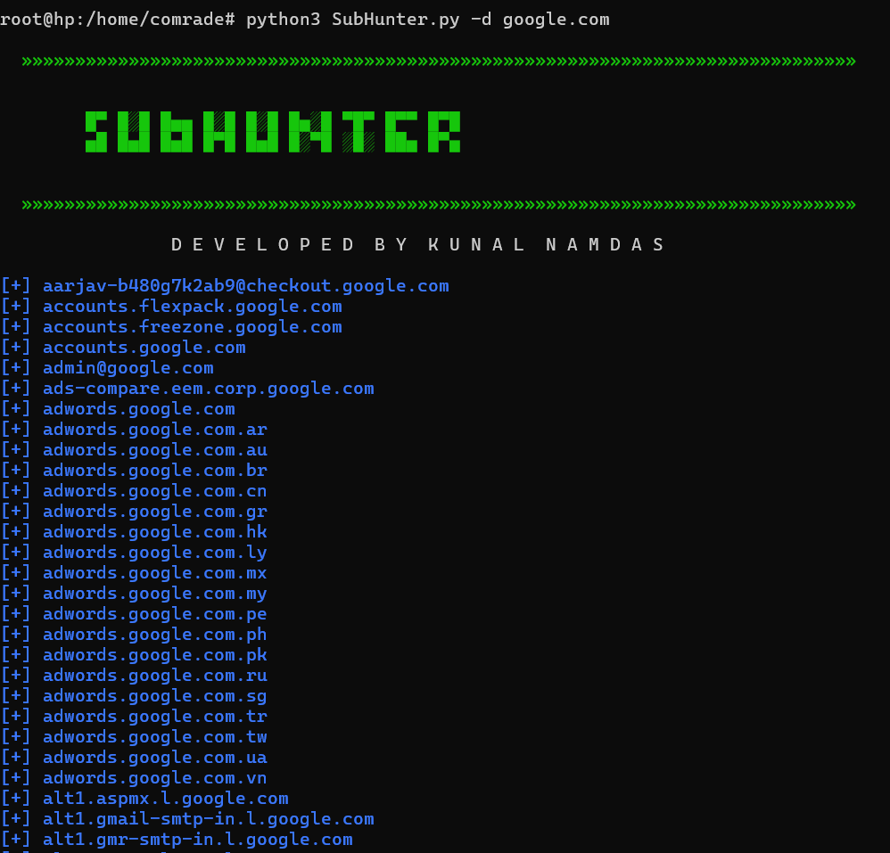
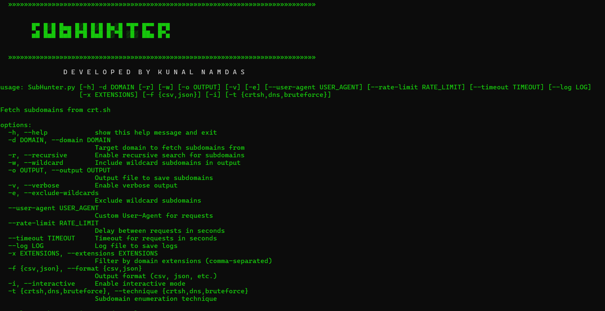

# SubHunter.py

SubHunter.py is a Python tool for fetching subdomains from crt.sh based on specified criteria. 
It is designed for security researchers and penetration testers to discover subdomains related to a specific domain, aiding in reconnaissance and vulnerability assessment.


---

## Features

- Fetch subdomains for a target domain from crt.sh.
- Recursive search option for subdomains.
- Include or exclude wildcard subdomains.
- Filter subdomains by domain extensions.
- Save subdomains to a file in JSON or CSV format.
- Customizable User-Agent for requests.
- Rate limiting between requests.

---
## Developer Name

### Kunal Namdas

### DorkHunter image



## How It Works

SubHunter.py uses the crt.sh service to retrieve subdomains related to a given domain. It sends HTTP requests to the crt.sh API, parses the JSON responses, and extracts the subdomains. The tool supports various options to customize the subdomain enumeration process:

#### Recursive Search: 
- If enabled, SubHunter.py will recursively fetch subdomains for any wildcard subdomains found.

#### Wildcard Handling: 
- You can choose to include or exclude wildcard subdomains in the results.

#### Domain Extension Filtering:
- Filter the fetched subdomains by specific domain extensions to narrow down the results.

#### Output Formats: 
- Save the fetched subdomains to a file in JSON or CSV format for further analysis or reporting.

#### Rate Limiting:
- Introduce a delay between requests to avoid hitting the crt.sh rate limits or being blocked.


## Command-line Options

#### python SubHunter.py -d <domain> [Options]

-d, --domain: Target domain to fetch subdomains from (required).

-r, --recursive: Enable recursive search for subdomains.

-w, --wildcard: Include wildcard subdomains in output.

-o, --output <file>: Save subdomains to the specified output file.

-e, --exclude-wildcards: Exclude wildcard subdomains from the final set.

--user-agent <user_agent>: Custom User-Agent string for requests (default: Mozilla/5.0).

--rate-limit <seconds>: Delay between requests in seconds (default: 0.0).

--timeout <seconds>: Timeout for requests in seconds (default: 25.0).

-x, --extensions <extensions>: Filter subdomains by domain extensions (comma-separated).

-f, --format <format>: Output format for subdomains (csv, json) (default: csv).

-v, --verbose: Enable verbose output.

-i, --interactive: Enable interactive mode.

-t, --technique <technique>: Subdomain enumeration technique (crtsh, dns, bruteforce) (default: crtsh).


## Examples
python SubHunter.py -d google.com

python SubHunter.py -d google.com -o subdomains.csv

python SubHunter.py -d google.com -o subdomains.json -f json

python SubHunter.py -d example.com -r

python SubHunter.py -d example.com -e

python SubHunter.py -d example.com --user-agent "MyCustomUserAgent/1.0"

python SubHunter.py -d example.com --rate-limit 2.0

python SubHunter.py -d example.com -x com,net

python SubHunter.py -d example.com -v


## Contributing

Contributions are welcome! Please feel free to fork the repository and submit pull requests or open issues for bug fixes, feature requests, or suggestion


## Steps to Contribute

Fork the repository.

Create a new branch for your feature or bug fix.

Make your changes and commit them with clear messages.

Push your changes to your forked repository.

Open a pull request to the main repository.


### Installation

Clone the repository and install dependencies:

```bash
git clone https://github.com/kunalnamdas/SubHunter.git
cd SubHunter
# Optionally, set up a virtual environment
pip install -r requirements.txt
#run
python SubHunter.py -d google.com


